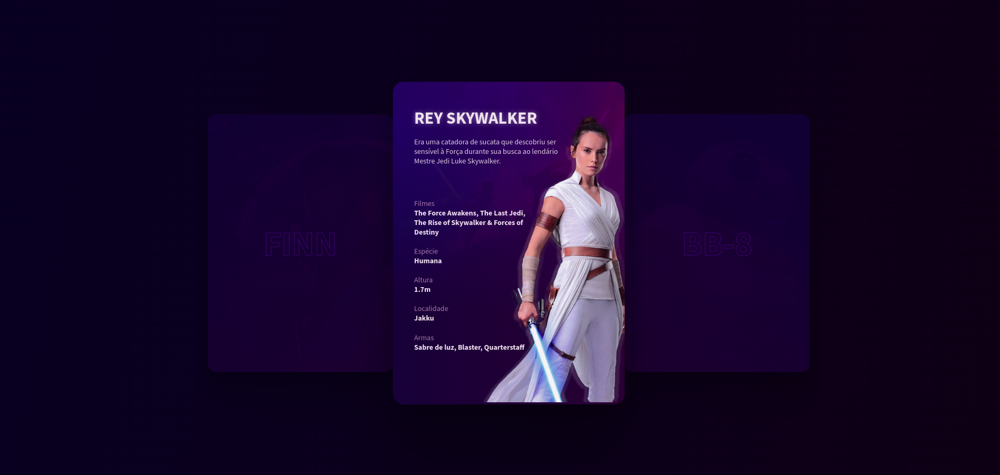

<h1 align="center">Capa de um Personagem</h1>

Projeto realizaso pela Rocketseat

## Tecnologias Usadas

- HTML e CSS
- GIT e GitHub
- javaScript
- Atropos

## Projeto 
Esse projeto foi feito com intuito de estudar desenvolvimento web, e usar uma biblioteca chamada atropos, para dar um efeito 3D.

## Imagem do projeto

